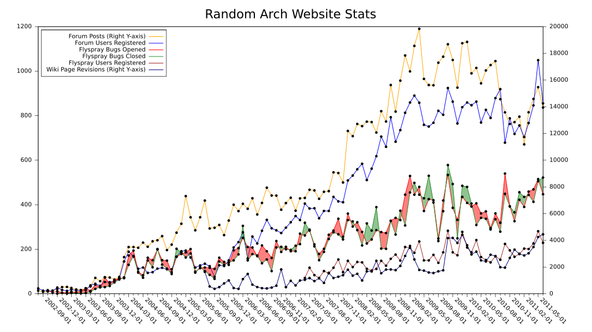

## Introdução

O **Arch Linux** é uma distribuição GNU/Linux de propósito geral desenvolvida independentemente, que se empenha em fornecer as últimas versões estáveis dos softwares adotando um modelo de lançamento contínuo, chamado de **rolling release**.

A instalação padrão, realizada a partir de um sistema base mínimo, é configurado pela pessoa usuária, permitindo que ela adicione apenas o que é intencionalmente imprescindível.

O **Arch Linux** baseia-se em cinco princípios:

- **Simplicidade**: **Arch Linux** define simplicidade como **sem adições** ou **modificações desnecessárias**. Distribui software conforme lançado pelas pessoas programadoras, com alterações mínimas específicas de distribuição.

- **Modernidade**: **Arch Linux** se esforça para manter as últimas versões estáveis dos softwares, desde que a quebra sistêmica de pacotes possa ser evitada na medida do possível. Ele se Baseia em um sistema de lançamento **rolling-release**, o qual permite uma instalação única com atualizações contínuas.

- **Pragmatismo**: **Arch Linux** é uma distribuição pragmática e não ideológica. Os princípios aqui são apenas diretrizes úteis. Em resumo, as decisões de projeto são realizadas caso a caso, através do consenso das pessoas desenvolvedoras. A análise técnica baseada em fatos e o debate são o que importa e não a política ou a opinião popular.

- **Centrado na pessoa usuária**: Enquanto muitas distribuições GNU/Linux tentam ser mais fáceis de utilizar, **Arch Linux** sempre foi, e sempre será, centrado na pessoa utilizadora. A distribuição destina-se a preencher as necessidades com aquelas pessoas que contribuem para ela, em vez de tentar atrair o maior número possível de pessoas utilizadoras. É dirigida à pessoa proficiente do GNU/Linux, ou a qualquer pessoa com uma atitude _"faça você mesmo"_ que esteja disposta a ler a documentação, e a resolver os seus problemas.

- **Versatilidade**: **Arch Linux** é uma distribuição de uso geral. Após a instalação, é fornecido apenas um ambiente de linha de comando; em vez de retirar pacotes desnecessários e indesejados, é oferecida à pessoa utilizadora a capacidade de construir um sistema personalizado, escolhendo entre milhares de pacotes de alta qualidade fornecidos nos repositórios oficiais para a arquitetura **x86-64**.

## História

A comunidade em volta do **Arch Linux** cresceu e amadureceu ao ponto de tornar uma das distribuições GNU/Linux mais populares e influentes, dado a atenção e as constantes revisões ao longo dos anos. As pessoas desenvolvedoras do **Arch Linux** são voluntárias e não remuneradas. Não exite nenhuma expectativa de monetizar o **Arch Linux**, se mantendo gratuito e livre em todos os sentidos.

**Judd Vinet** foi a pessoa que iniciou o desenvolvimento do **Arch Linux** no início de 2001. O primeiro lançamento do **Arch Linux**, versão 0.1, ocorreu em 2002. A construção do **Arch Linux** foi inspirada pela simplicidade e elegância do [**Slackware**](http://www.slackware.com/), [**BSD**](https://pt.wikipedia.org/wiki/Berkeley_Software_Distribution), [**PLD Linux**](https://www.pld-linux.org/) e [**CRUX**](https://crux.nu/) e da ausência de uma ferramenta de gestão de pacotes. **Vinet** construiu a sua própria distribuição com princípios semelhantes aos das distros mencionadas anteriormente. Também desenvolveu um programa de gestão de pacotes chamado **pacman**, capaz de manipular a instalação, remoção e atualização de pacotes.

A comunidade em volta do **Arch Linux** cresceu constantemente entre os anos de 2002 e 2011 e ficou conhecida como uma comunidade [aberta, amiga e útil](https://www.osnews.com/story/4827/). A Figura 1 abaixo mostra, de forma visual, esse crescimento através das postagens, pessoas e relatório de erros no site oficial do **Arch Linux** desse período:

||
|--------|
|**Figura 1**: Estatísticas de acesso ao website do **Arch Linux** entre os anos 2002 e 2011|

Outros acontecimentos importantes ocorreram ao longo dos anos, abaixo seguem os principais:
- _2005_: Nascimento da [**ArchWiki**](https://wiki.archlinux.org/title/ArchWiki:About#Early_history) utilizando o [MediaWiki](https://wiki.archlinux.org/title/MediaWiki);
- _2007_: Judd Vinet deixou de ter uma participação ativa como desenvolvedor do **Arch Linux** e transferiu a liderança ao programador estadunidense Aaron Griffin, conhecido também como _Phrakture_;
- _2012_: O [lançamento da imagem de instalação](https://archlinux.org/news/install-media-20120715-released/) tornou obsoleto o _Arch Installation Framework_ (AIF) em favor do _Arch Install Scripts_ ([arch-install-scripts](https://archlinux.org/packages/?name=arch-install-scripts));
- _2012-2013_: O tradicional sistema de inicialização _System V_ foi [substituído](https://archlinux.org/news/end-of-initscripts-support/) pelo _systemd_;
- _2017_: Foi anunciado que o suporte à arquitetura _i686_ seria terminado de forma gradual devido a sua baixa popularidade entre as pessoas desenvolvedoras e a comunidade. No final de 2017 todos os pacotets _i686_ foram removidos dos servidores;
- _2020_: Em um esforço da equipe do **Arch Linux** concebeu um novo processo para definir as futuras lideranças do projeto, devidamente documentado na [ArchWiki](https://wiki.archlinux.org/title/DeveloperWiki:Project_Leader). 
 
Com a decisão de Aaron Griffin de renunciar ao seu papel de liderança, foi realizada uma votação para eleger uma nova pessoa e o resultado foi publicado em 24/02/2020, tornando oficial a eleição de **Levente Polyak**.

## Conclusão

Neste artigo foi abordado sobre o **Arch Linux**, seus princípios de projeto e um pouco da sua história. Apesar de o texto não conter nada técnico, é importante entendermos o como e o porquê do surgimento das ferramentas que utilizamos em nosso dia a dia.

Gostou do artigo? Deixe o **Like**! Quer comentar ou sugerir algo? Entre em contato comigo pelas minhas redes sociais!

Até a próxima!

## Referências
1. https://wiki.archlinux.org/title/Arch_Linux
2. http://www.slackware.com/
3. https://pt.wikipedia.org/wiki/Berkeley_Software_Distribution
4. https://www.pld-linux.org/
5. https://crux.nu/
6. https://www.osnews.com/story/4827/